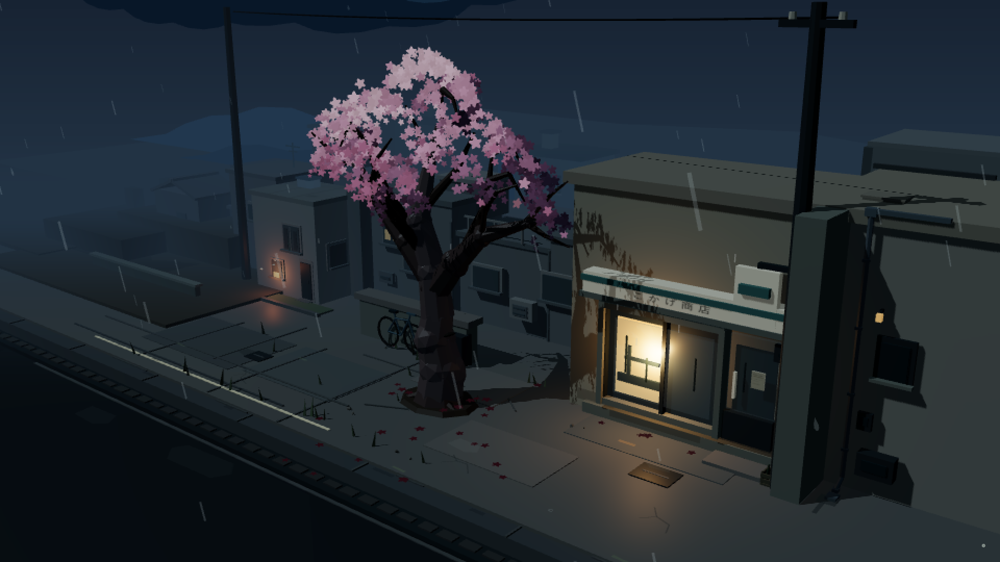
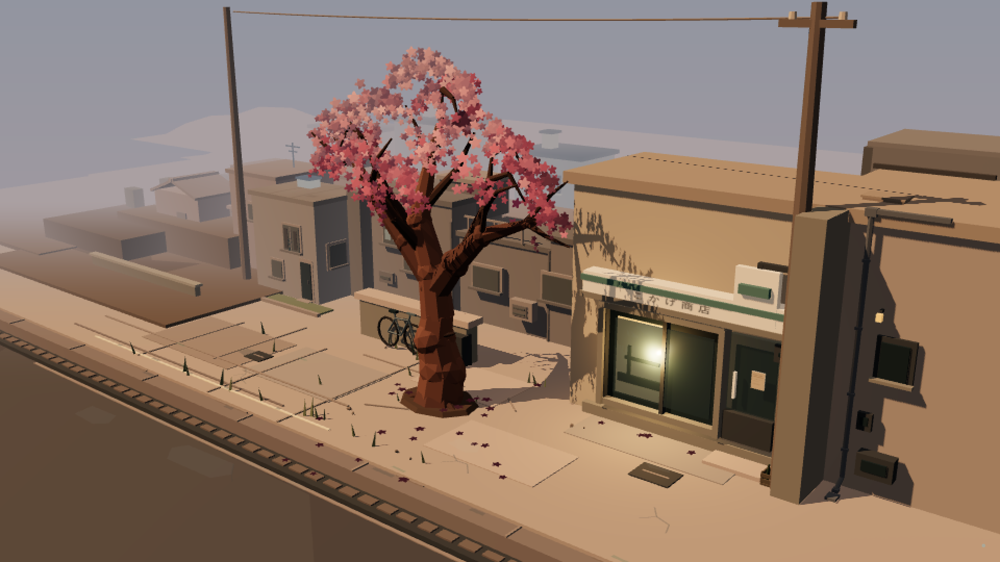

# Nocturne — Sakura Corner

A quiet, interactive street corner: a pink cherry tree, a warm neighborhood
shop, and a little weather passing through. Built with Three.js.

[**Open the scene →**](https://charlesmish.github.io/sakura_corner/)



## Spend a moment here

Click or tap the tree to release a few petals. Open the small dot in the
bottom-right corner to choose **Rain**, **After rain**, **Clear**, or **Snow**.
After rain also offers a single optional firefly.

Snow is a light spring flurry, with the pink canopy still in bloom. Look
closely for the shop's painted lettering, a tucked-away bottle crate, a plant
behind an upstairs window, and small signs of roof repairs.

### A change in weather

These are the current scene previews. Select an image to see it at full size.

| After rain | Clear | Snow |
| :---: | :---: | :---: |
| [](docs/images/after-rain.png) | [](docs/images/clear.png) | [](docs/images/snow.png) |

## Run locally

Use Node.js 22.12 or newer, then:

```sh
git clone https://github.com/CharlesMish/sakura_corner.git
cd sakura_corner
npm ci
npm run dev
```

Open the local address printed in the terminal. The scene requires JavaScript
and a browser with WebGL support.

Weather choices are bookmarkable: `?weather=rain`, `?weather=wet`,
`?weather=clear`, or `?weather=snow`. Use `?weather=wet&firefly=1` for the
optional firefly. Switching weather briefly fades and restarts the scene.

The weather control supports touch and keyboard input. Reduced-motion
preferences hide snowflakes and the firefly and remove the interface fades;
the existing tree, petal, and hearth animation remains active.

## Development

`npm run build` creates a production build; `npm run preview` serves it locally.
See the [development notes](docs/README.md) for checks and scene-review details.
